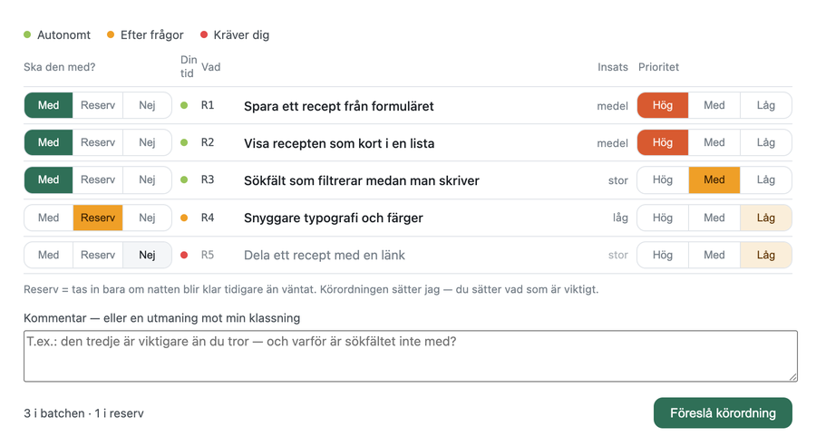
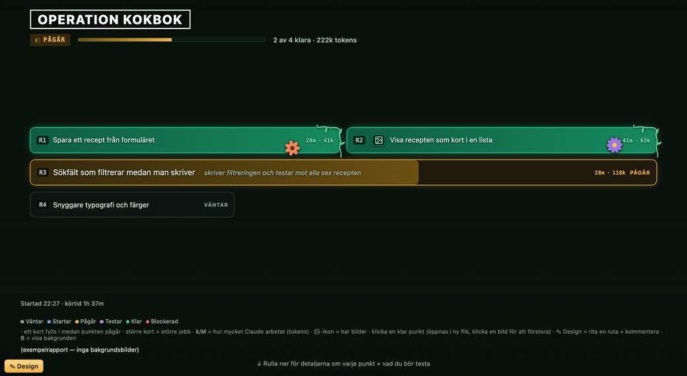

# webapp-kit

Ett **Claude Code-plugin** som paketerar ett helt arbetssätt för att bygga webbappar med Claude Code —
så att det finns på plats i *alla* dina projekt, inte bara i det där det råkade uppstå.

## Vad det är, i klartext

Claude Code kan bygga webbappar åt dig. Problemet är sällan att den inte *kan* — det är att
längre jobb spårar ur: du tappar överblicken över vad som är gjort, nästa session har glömt
allt ni kom fram till, och "gör det snyggt" ger något annat än du tänkte dig.

Pluginet lägger ett arbetssätt ovanpå:

- **Du väljer och prioriterar visuellt.** Räknar du upp tolv saker du vill ha fixade får du en
  klickbar ruta där du för varje punkt väljer *med*, *bara om det finns tid över* eller *hoppa*,
  och märker ut vad som är viktigast — i stället för en vägg av text att svara på. Ordningen att
  göra dem i föreslår Claude sedan, och du får godkänna den innan något startar.
- **Du ser vad som händer medan det händer.** Arbetet redovisas på en resultatsida i
  webbläsaren som uppdateras live, med skärmdumpar på det som byggts och hur du testar det.
  Sidan blir kvar som slutrapport.
- **Projektet minns.** Några få anteckningsfiler håller reda på vad appen ska bli, var ni står
  och vad som redan gjorts — så nästa session inte börjar från noll.
- **Design har en process.** Från skiss till färdig look, med skärmdumps-jämförelser i stället
  för "flytta den 8 pixlar till vänster" i chatten. Skissverktyget och skärmdumps-loopen
  fungerar för vilken webbapp som helst; den fylligare delen (färdiga komponenter och teman)
  förutsätter att appen byggs med React/Next.js + Tailwind. Gör den inte det säger Claude det
  rakt ut och kör den enklare vägen i stället.

**Du behöver inte kunna köra kommandon i en terminal.** Verktygen i pluginet är till för att
*Claude* ska köra dem åt dig.

## Så här ser det ut

**Du väljer och prioriterar i en klickbar lista** — inte i en vägg av text:



**Sedan följer du arbetet på en sida som uppdaterar sig själv**, och som blir kvar som
slutrapport när allt är klart:



Vill du klicka runt i en färdig rapport innan du installerar något:
öppna [`templates/exempel/exempel-batch.html`](templates/exempel/exempel-batch.html) i din
webbläsare. Det är en riktig, avslutad rapport för en påhittad receptapp — med bilder,
testfall och en sammanfattning av hur körningen gick.

## Kom igång

1. **Installera pluginet** (se [Installera](#installera) nedan).
2. **Öppna ditt projekt i Claude Code** — eller en tom mapp, om appen inte finns än.
3. **Skriv i chatten:** `kom igång med webapp-kit`

Claude introducerar då pluginet, sätter upp projektets anteckningsfiler åt dig och frågar vad
du vill göra först. Det är hela uppsättningen — inga kommandon, inga filer att kopiera.

## Vad du kan säga sedan

Fem saker att säga i chatten, med dina egna ord. Skill-namnen inom parentes behöver du aldrig
skriva — de triggar på beskrivningen.

| Du skriver ungefär | Vad som händer |
|---|---|
| *"jag vill fixa de här sakerna: …"* | Du får en klickbar lista att välja och prioritera i, sedan betas punkterna av en och en med live-redovisning. *(webapp-batch)* |
| *"kör det här medan jag sover"* | Samma sak, riggat för att gå långt utan sällskap — plus en läsbar rapport att vakna till. *(long-run, breakfast-report)* |
| *"jag vill att det ska se ut så här"* + bild | Design- och layoutarbete med skärmdumps-jämförelse tills det stämmer. *(design-workflow, visual-iterate)* |
| *"håll ordning på projektet"* | Anteckningarna städas så nästa session startar varm. *(doc-hygiene)* |
| *"jag vill skissa hur sidan ska se ut"* | Claude öppnar ett skissverktyg i din webbläsare där du drar rutor och skickar skissen vidare med en knapp. *(design-workflow)* |

**Två kommandon att komma ihåg** när du kör fast:

| Skriv | Vad du får |
|---|---|
| `/webapp-kit:hjalp` | Kort lista över vad du kan göra just nu, och hur du tar dig ur de vanligaste kniporna |
| `/webapp-kit:om` | Det längre svaret på vad pluginet är — **och vad det inte är och inte kan** |

Vill du hellre välja i en meny finns skillarna under `/` — de heter `webapp-kit:` följt av
skillens namn, t.ex. `webapp-kit:kom-igang`.

**Om långa pass och vad de kostar:** ett obevakat nattpass drar en rejäl del av din
Claude-kvot — det är många timmars arbete. Claude håller själv koll på hur mycket utrymme
som är kvar, säger till i förväg när det börjar ta slut, och avslutar städat i stället för
att stanna mitt i. Är du osäker: börja med ett kort pass på några punkter och se hur det
känns innan du kör en hel natt.

## Installera

**I Claude Code-appen** — inget terminalarbete:

1. **Skriv `/plugin` i chattrutan och tryck retur.** Det öppnar plugin-hanteraren. (Det är
   ett kommando till appen, inte till en terminal — du skriver det på samma ställe som du
   skriver allt annat till Claude. Finns hanteraren även som en *Plugins*-post i appens
   inställningar går den vägen förstås lika bra.)
2. Välj att **lägga till en marknadsplats**. En "marknadsplats" är bara en adress dit
   Claude hämtar plugins ifrån — här är adressen till projektet på GitHub:
   **`gransgelby/claude-webapp-kit`**. Klistra in den precis så.
3. Marknadsplatsen heter **`andreas-plugins`** när den dykt upp i listan (namnet på
   *samlingen*, inte på adressen — de behöver inte likna varandra). Installera
   **`webapp-kit`** ur den.
4. **Börja en ny chatt.** Pluginet laddas när en session startar, så det som redan är
   igång känner inte till det än. Du behöver inte starta om appen eller datorn.

**Så vet du att det funkade:** skriv `/` i chatten och se efter att det finns poster som börjar
med `webapp-kit:` i listan (det ska vara tio stycken — åtta skills och två kommandon). Skriv sedan `kom igång med webapp-kit`
så presenterar Claude pluginet och frågar om ditt projekt.

Syns inga `webapp-kit:`-poster alls är pluginet inte laddat — börja en ny chatt och titta igen.
Syns de flesta men inte alla: du har troligen en chatt som startade innan pluginet
installerades eller uppdaterades. Skill-listan sätts när sessionen börjar, så en ny chatt
löser det. **Avinstallera inte** på grund av en enskild post som saknas.

Installerat gäller det alla dina projekt. Skillarna dyker också upp i `/`-menyn som
`webapp-kit:<namn>`, men du behöver aldrig använda menyn — de startar av sig själva utifrån
vad du skriver.

Kör du hellre från terminalen mot en lokal kopia:

```bash
claude --plugin-dir /path/to/claude-webapp-kit
```

### Det här behöver finnas på datorn

**Du behöver inte kontrollera något av detta själv.** Skriv `kolla att webapp-kit har allt
det behöver` i chatten, så testar Claude vart och ett, säger vad som eventuellt fattas och
installerar det som går att installera. Listan nedan är bara till för den som vill veta:

| Krävs för | Vad | Utan det |
|---|---|---|
| Allt | **node** och **python3** | Inga av verktygen i `bin/` fungerar |
| Skärmdumpar | **Google Chrome** + paketet **`puppeteer-core`** | Inga bilder på dashboarden, ingen före/efter-jämförelse, ingen visuell finjustering |
| Före/efter-bilder | python-paketet **`Pillow`** | Enskilda skärmdumpar fungerar, men de kan inte klistras ihop till en jämförelsebild |

`node`, `python3` och Chrome finns oftast redan på en dator som kört Claude Code mot ett
webbprojekt. **`puppeteer-core` och `Pillow` gör det inte** — de installeras vid behov, och Claude gör
det första gången bilder behövs. Vill du hellre köra utan bilder går det bra: allt annat fungerar,
men be Claude skriva i rapporten varför de saknas.

### Om pluginet ligger i ett privat repo

Är repot privat (t.ex. för att det delats med enskilda personer i stället för att vara öppet)
räcker det inte att klistra in adressen — datorn måste också kunna visa **vem du är** mot
GitHub, annars misslyckas installationen med ett tekniskt fel.

Det behöver du inte fixa själv. Skriv i chatten: **`hjälp mig logga in mot GitHub`** — Claude
kör inloggningen och säger till när du ska klicka i webbläsaren. Först därefter fungerar
steg 1–4 ovan. Har du fått en inbjudan till repot: **acceptera den först**, annars ser
GitHub det som att projektet inte finns.

### Om du vill sluta använda pluginet

Avinstallera det i samma plugin-vy som du installerade det i. **Filerna i ditt projekt
påverkas inte** — `App_vision.md`, `Project_state.md` och de andra är vanliga textfiler som
blir kvar och går att läsa (eller radera) som vilka som helst. Din app rörs inte alls.

## Sätta upp ett projekt

Säg **`kom igång med webapp-kit`** i chatten så gör Claude det åt dig — inklusive att fylla
anteckningsfilerna tillsammans med dig.

Under huven kör den det här (du behöver inte göra det själv):

```bash
node "$CLAUDE_PLUGIN_ROOT/bin/kit-init.mjs" --namn "Projektnamn"
```

Det lägger doc-roll-filerna (App_vision / Project_state / Reference / Backlog /
Project_history) i projektet, plus en `CLAUDE.md` som pekar på pluginets skills, en
`.gitignore` och `docs/`-mappen. **Skriver aldrig över något som redan finns** — säkert att
köra igen i ett halvuppsatt projekt.

## Vad som ingår (tekniskt)

> **Härifrån och ned är detaljer för den som vill veta hur det fungerar under huven.**
> Vill du bara *använda* pluginet är du klar — du behöver inget härifrån. Hoppa till
> [Doc-roller](#doc-roller-kort) om du är nyfiken på filerna i ditt projekt, eller stäng
> sidan och skriv `kom igång med webapp-kit` i chatten.

**Skills** (auto-triggar på beskrivning, eller kör manuellt med `/webapp-kit:<namn>`):

| Skill | Trigger | Vad den gör |
|---|---|---|
| `kom-igang` | "kom igång med webapp-kit", "vad är det här?" | Introducerar pluginet i klartext, sätter upp projektets anteckningsfiler och frågar vad användaren vill göra först |
| `webapp-batch` | "starta batchjobb", backlog-tabell | Preflight (ett kommando riggar batchen) → interaktiv backlog-widget (läge + prioritet + autonomi-märkning per post) → frågerunda → live HTML-dashboard → körning → slutrapport med testfall |
| `long-run` | stort/obevakat pass, "nattkörning" | Subagent-per-post-spelbok: eget context per deljobb, sekventiellt för fil-rörande, circuit-breaker, committa per klar post |
| `breakfast-report` | efter obevakat pass | Fristående HTML-rapport på disk med base64-skärmdumpar + text per åtgärd |
| `design-workflow` | design/UI-arbete | Wireframes → shadcn + tokens → inspiration/känsla → tweakcn/DaisyUI → tre körfält (struktur/look/nagg) + grid-alignment |
| `visual-iterate` | finjustera UI, "ändra så här" | Skärmdumps-loop: expected-vs-actual, stagade prompter, Claude stänger loopen med egen skärmdump |
| `illustrate` | "rita en …", diagram/ikon/SVG | Sexstegsprocess med granskningsloop mot korrekthet, tydlighet och skönhet — gäller allt som ska ritas i kod |
| `doc-hygiene` | "granska dokumentationen", batch-slut | Doc-roll-system (vision/state/reference/backlog/history) + sweep mot dubblering/drift |

**Kommandon** (`commands/`): `/webapp-kit:hjalp` (vad du kan göra just nu) och `/webapp-kit:om` (vad pluginet är, gör bra, och inte är). De skiljer sig från skillarna genom att de bara svarar — de startar inget arbete.

**Agent:** `batch-worker` — subagent-typen som utför en enskild batch-post i eget context och returnerar en kort sammanfattning.

**Hooks:** fyra skript, registrerade sju gånger över fem händelser (`hooks/hooks.json`). Vid **SessionStart**: `projektkort.py` (projektets grundfakta, tyst i projekt utan `Project_state.md`), `session-pointer.sh` (pekare till pluginets ingångar, anpassar sig efter om projektet är uppsatt) och `runtime-status.py` (arbetsbudget). `runtime-status.py` kör dessutom vid **UserPromptSubmit**, **PostToolUse** och **SubagentStop** — det är den som skriver `[arbetsbudget]`-raden. Vid **PreToolUse på `Agent`**: `batch-guard.mjs`, som påminner om riggning, arbetsbudget, verifierar-steget och om att subagenters leverans ska till fil. Ingen av dem blockerar något.

**bin/** — genericerad tooling, alla tretton: `kit-init.mjs` (sätter upp ett projekt, se ovan; `--kolla` verifierar förutsättningarna), `batch-preflight.mjs` (riggar en batch, se nedan), `batch-guard.mjs` (hooken på `Agent`), `session-pointer.sh` + `projektkort.py` + `runtime-status.py` (de tre SessionStart-hookarna), `shot.mjs` (element-skärmdump), `granska-bild.mjs` (granskningslägen + pixeldiff för illustrationer), `krav-puppeteer.mjs` (delat krav-fel för de två föregående), `compose.py` (före/efter-komposit), `batch-bg.py` (dashboard-bakgrund), `check-design-tokens.mjs` (token-lint: hårdkodade färger + spacing), `wireframe.html` (wireframe-editor, se nedan).

**templates/** — `batch-dashboard.html` + `-data.js` (live-dashboard-mallen), `batch-urvalswidget.html` (den klickbara listan där du väljer och prioriterar — steg 1 i varje batch), `project-skeleton/` (doc-roll-filer + `CLAUDE.md` + `.gitignore` som `kit-init.mjs` kopierar in) `exempel/` (en färdig resultatsida och tre ifyllda anteckningsfiler att titta på — används inte av något, går att radera) och `design-tool/` (en skeppad DesignTool + `<PageGrid>` för Next.js/React-appar, med egen README — kräver att du kan koda och är helt frivillig).

### batch-preflight.mjs — riggningen som ett kommando

*Claude kör det här åt dig när en batch startas — du behöver inte skriva det själv.*

```bash
node "$CLAUDE_PLUGIN_ROOT/bin/batch-preflight.mjs" --bas batch-2026-08-01-nattpass --namn "Operation X" \
    [--gren batch/2026-08-01-nattpass] [--poster 12]
```

Kontrollerar att basnamnet och batchnamnet inte redan är använda (ett återanvänt basnamn ärver
förra batchens `localStorage`; ett återanvänt namn gör passen omöjliga att skilja åt i efterhand),
skapar grenen, kopierar dashboard-mallen till `reports/<bas>.html` + `<bas>-data.js`, lägger
`<bas>-img/` och en `<bas>-state.md`, skriver in namnet i `docs/batch-historik.json` — och listar
sist det som **återstår** och som skriptet inte kan göra åt dig (namn/talesätt, bakgrundsbilder,
en post per punkt, urvalswidgeten, ordningsförslaget). Exit 1 med läsbart skäl när något krockar,
och inga halvvägs-ändringar: alla kontroller körs före första skrivningen.

Varför det finns som ett skript i stället för som en instruktion: riggningen stod i prosa som läses
en gång vid passets start, och i ett verkligt pass hoppades alla sex stegen över. `batch-guard.mjs`
är samma påminnelse i hook-form — den fyrar när en `batch-worker` startas utan att någon
`reports/*-data.js` står på `"running"`. Den **blockerar aldrig** (alltid `allow`), och varje
påminnelse tystnar när dess eget villkor är uppfyllt: riggningen när dashboarden drivs,
verifieraren när granskningen är gjord, budgeten när det finns marginal, filleveransen när
prompten pekar ut en fil. Alla fyra kan vara tysta samtidigt — men "riggningen är gjord"
räcker bara för den första av dem.

### wireframe.html — skissa layout och lämna över till Claude

Säg **"öppna wireframe-verktyget"** i chatten så öppnar Claude filen i din webbläsare (den
ligger inuti pluginet — du behöver inte leta upp den på disk). Ingen server, inga beroenden.
Dra i rutnätet för att skapa rutor, namnge dem och skriv en kommentar per ruta. **Kopiera för
Claude** lägger en markdown-tabell på urklipp som du klistrar in i chatten.

Poängen är utdataformatet: rutorna snäpper **alltid till kolumn- och radspann**, aldrig
till fria pixlar. Claude får därför *grid-avsikt* (`kol 9–12 (spann 4)`) som direkt kan
översättas till `col-span-*` + gap ur spacing-token — i stället för
`position:absolute; top:340px`, som ger en icke-responsiv layout och är precis det
`design-workflow`-skillen varnar för.

**Rad 10 = vikningen på en MacBook Pro 14″.** Radhöjden är låst till 5,7 % av bredden, så
tio rader motsvarar exakt en skärm och allt under den streckade linjen kräver scroll — en
skiss som är dubbelt så hög som skärmen ljuger annars om vad som får plats.

Rutorna ritas som klassiska wireframe-block (streckad ram, mellangrå fyllning); typen bärs
främst av ramens kulör, och ytan får bara en antydan till samma ton — så att layouten är det
som syns, inte färgerna. Arbetet sparas
i `localStorage` och kan exporteras/öppnas som JSON.

Färgerna i filen är medvetet **literala, inte CSS-variabler**: verktyget öppnas i allt från
Safari till inbäddade snapshot-vyer, och en renderare som inte löser `var()` gör annars hela
gränssnittet oformaterat. Kontrasterna är mätta mot WCAG 2.1 AA, och de bärande färgparen har sitt kontrastvärde noterat som kommentar i filen.

## Doc-roller (kort)

- **App_vision.md** – vart vi ska (vision, syfte, designprinciper).
- **Project_state.md** – var vi är (kort nuläge + orienteringskarta). Läses varje session → håll kort.
- **Reference.md** – hur det är byggt (teknisk uppslagsbok). Läses vid behov.
- **Backlog.md** – vad vi kanske gör sen (en rad per spår, stabila ID:n).
- **Project_history.md** – vad som gjorts (kronologisk klar-logg, nyaste överst).

Ingen dubbel bokföring: ett faktum har *en* hemvist, korslänka i stället för att kopiera.

## Struktur

```
.claude-plugin/plugin.json   manifest
commands/<namn>.md            /webapp-kit:hjalp och /webapp-kit:om
skills/<namn>/SKILL.md        en mapp per skill
agents/batch-worker.md        subagent-definition
hooks/hooks.json              4 skript, 7 registreringar: 3 vid SessionStart, arbetsbudget löpande, vakt på Agent
bin/                          13 verktyg (kit-init/preflight/shot/compose/batch-bg/token-lint …) + hook-script
templates/                    dashboard-mall + urvalswidget + projekt-skelett + design-tool
```

## Ursprung & bakgrund

Destillerat ur filer i det projekt pluginet växte fram i (de ligger alltså inte här):
`CLAUDE.md`, `docs/batch-jobb-process.md`,
`docs/breakfast-report-plan.md`, `docs/design-process.md` och design-workflow-utredningen.
